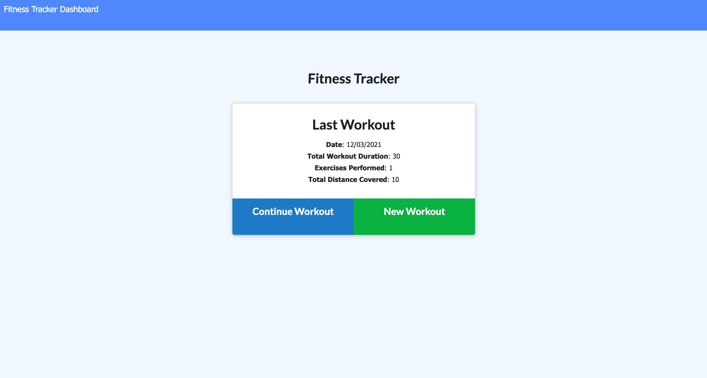
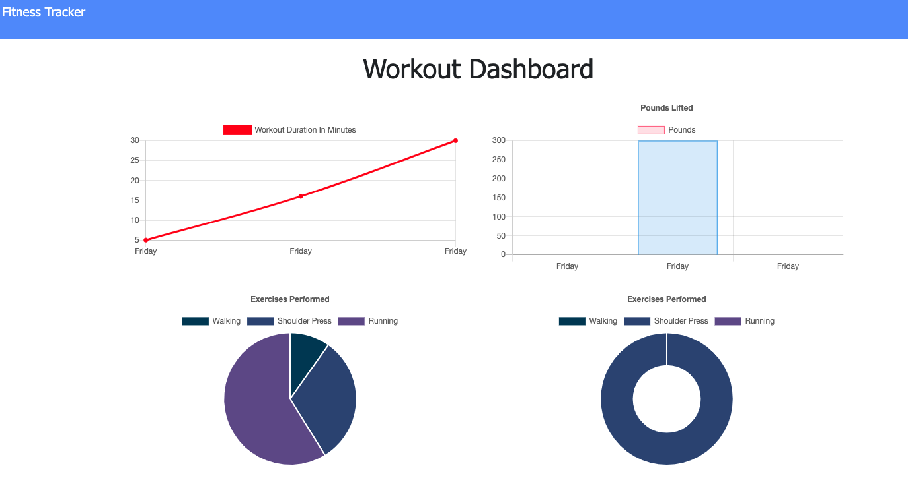

# Workout Tracker

## Description

This app allows the user to able to view, create and track daily workouts. The user is able to log multiple exercises in a workout on a given day. The user is also able to track the name, type, weight, sets, reps and duration of exercise. This app allows consumers to reach their fitness goals more quickly when they track their workout.

## Criteria

When the user laods the page, they are given the option to create a new workout or continue with their last workout.

The user is able to:
   
   * Add exercises to the most recent workout plan

   * Add new exercises to a new workout plan

   * View the combined weight of multiple exercises and the total duration of each workout from the past seven workouts on the tracker page

 ## Homepage
 
 

 ## Tracker Page

 

